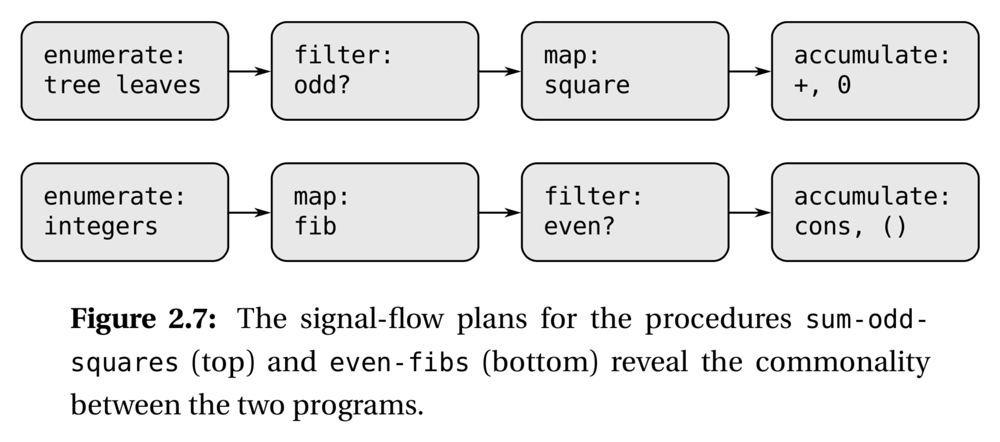
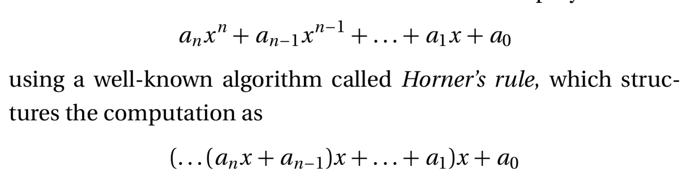

## Sequence Operations




```lisp
(define (filter predicate sequence)
    (cond ((null? sequence) nil)
          ((predicate (car sequence))
           (cons (car sequence)
                 (filter predicate (cdr sequence))))
          (else (filter predicate (cdr sequence)))))
```

For example,

    (filter odd? (list 1 2 3 4 5))
    (1 3 5)

Accumulations can be implemented by :

```lisp
(define (accumulate op initial sequence)
    (if (null? sequence)
        initial
        (op (car sequence)
            (accumulate op initial (cdr sequence)))))
```

For example,

    (accumulate + 0 (list 1 2 3 4 5))
    15

We need to enumerate the sequence of elements,

```lisp
(define (enumerate-interval low high)
    (if (> low high)
        nil
        (cons low (enumerate-interval (+ low 1) high))))
```

To enumerate the leaves of a tree, we can

```lisp
(define (enumerate-tree tree)
    (cond ((null? tree) nil)
          ((not (pair? tree)) (list tree))
          (else (append (enumerate-tree (car tree))
                        (enumerate-tree (cdr tree))))))
```

Now we can see the power of modular:

```lisp
(define (sum-odd-squares tree)
    (cond ((null? tree) 0)
          ((not (pair? tree))
           (if (odd? tree) (square tree) 0))
          (else (+ (sum-odd-squares (car tree))
                   (sum-odd-squares (cdr tree))))))

(define (sum-odd-squares tree)
    (accumulate +
                0
                (map square
                     (filter odd? (enumerate-tree tree)))))

(define (even-fibs n)
    (define (next k)
      (if (> k n)
          nil
          (let ((f (fib k)))
            (if (even? f)
                (cons f (next (+ k 1)))
                (next (+ k 1))))))
    (next 0))

(define (even-fibs n)
    (accumulate cons
                nil
                (filter even?
                        (map fib (enumerate-interval 0 n)))))
```

## Horners's rule

We know how to evaluate a polynomial,



### Todo-lists

- [ ] Q-2.35
- [ ] Q-2.36
- [ ] Q-2.37
- [ ] Q-2.38
- [ ] Q-2.39
